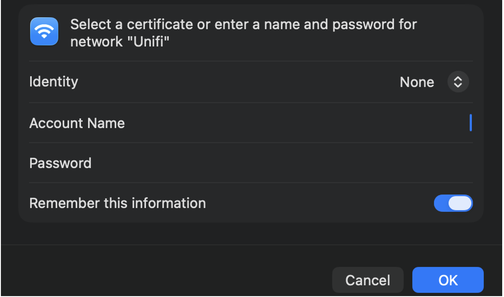
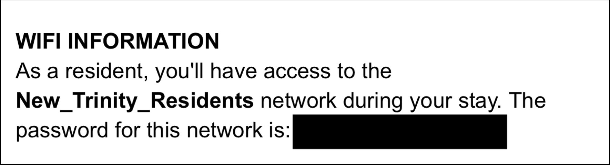
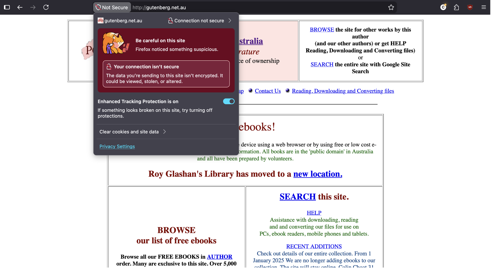
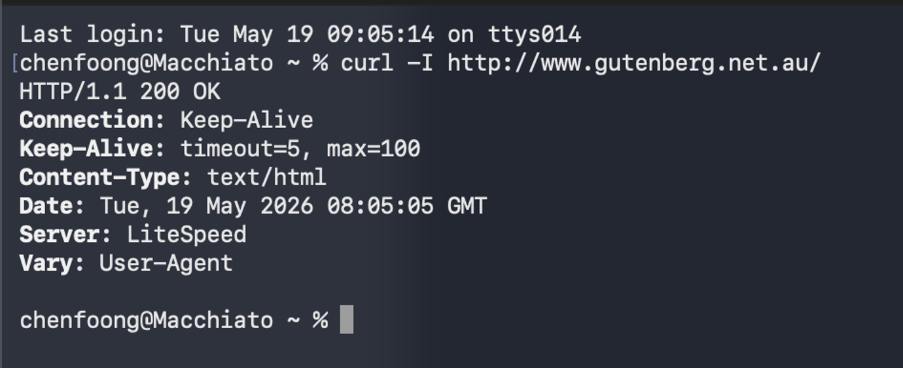
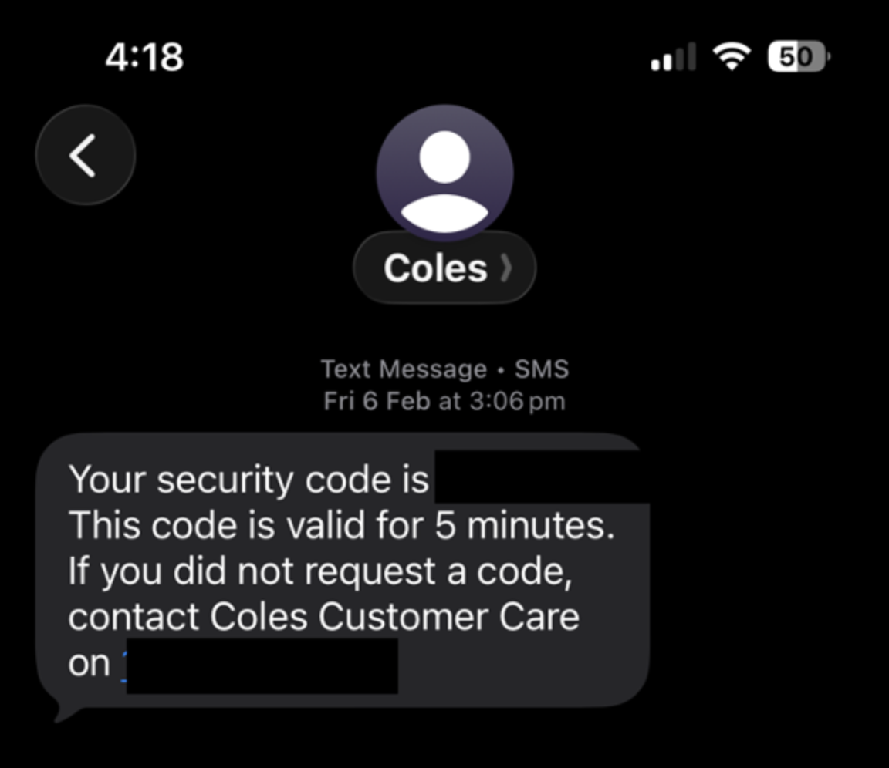
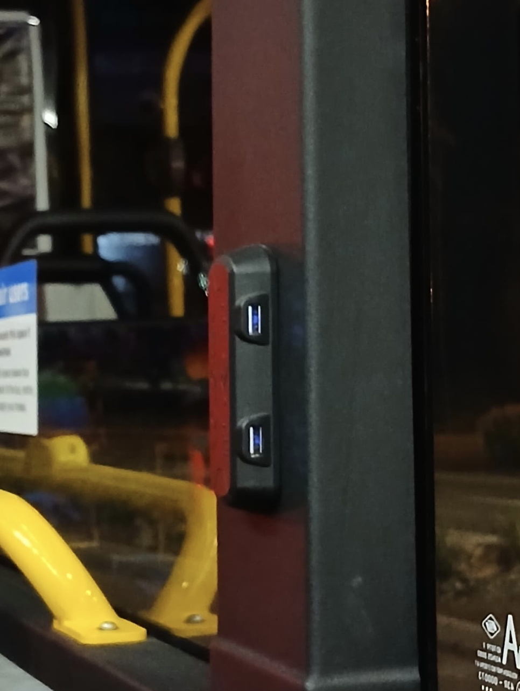
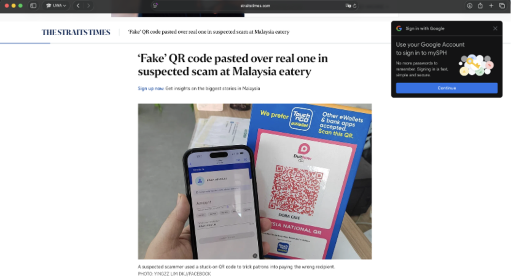

B1. Discover 5 unique weak/vulnerable security implementations.
Overview: I identified 5 weak or vulnerable security implementations that appears in real systems. I have given examples across different areas, these include Wi-Fi, web security, authentication, passwords and QR codes. These do not always lead to attacks but are implementations that could create unnecessary risk.

1.	Shared Wi-Fi password (or Wi-Fi with no password)
    A shared Wi-Fi password is weak because many users authenticate using the same secret. If the password is leaked, it is difficult to track which user leaked it, and which device (bad actors) should be blocked. This is different from enterprise Wi-Fi authentication, where each user authenticates individually.
    A shared network is acceptable for convenience (e.g. a single password for Wi-Fi authentication at home), but it gives weaker accountability and access control. 

    Example of safer enterprise implementation (Unifi from UWA, requires username and password):

    

    Example of shared (risky) password (Trinity): 

    
 

2.	Website available over plain HTTP. 
    I found the Project Gutenberg Australia http://www.gutenberg.net.au/ still loads over HTTP. This is verified by running a header check, which retuned HTTP/1.1 200 OK, which meant that the page loaded directly over HTTP rather than redirecting to HTTPS. Even though the HTTPS version also works, the weakness is that the HTTP version is still accessible. If a user accesses the HTTP URL, the page would not be protected by TLS, so an attacker could potentially read or even modified by intercepting the connection. 

    
    
 
 
3.	SMS based MFA. 
    SMS based multi factor authentication is better than only using a password, but it is weaker than other phishing-resistant types of MFA. This is as SMS codes can be targeted through SIM swapping, phishing pages or even through social engineering. If a user types the SMS code on a fake website, the attacker would be able to reuse the code quickly. 
    This is a weak implementation of MFA, and higher risk accounts should implement other forms of MFA like passkeys, authenticator apps or hardware security keys. 
 
    
 

4.	Public USB Charging ports
    Some public spaces provide USB charging pots for convenience. This is however less secure than a normal power outlet because USB can carry both power and data. If a public USB port is tampered with and compromised, a device could potentially be exposed to data transfer attempts or even using prompts to trick the user into trusting the connected device. This is also known as “juice jacking”. A safer implementation is to provide normal AC power outlets only, or for the user to simply bring their own power bank if they only have USB cables. 

    

5.	QR Codes Implementation
    QR codes are convenient, but they can hide the actual destination until it is scanned. This makes them especially risky when placed in public areas or used as payments. In Malaysia (where I’m from), a common payment method is through Touch and Go E-wallet. Through this platform, restaurants (businesses) can generate a QR code for customers to scan to pay. However, there have been instances where fake QR codes were allegedly pasted over a real one at an eatery, tricking customers into paying to the wrong recipient. 
    This shows the weakness of just using static QR codes. Humans would not be able to notice as the QR code itself is not human-readable. A stronger implementation would instead be to include a better form of payment recipient confirmation, or using the QR code on device rather than having it printed. 

    
 
 
https://www.straitstimes.com/asia/se-asia/malaysia-eatery-uncovers-suspected-scam-of-pasting-wrong-qr-code-over-correct-one-to-divert-payments
 
