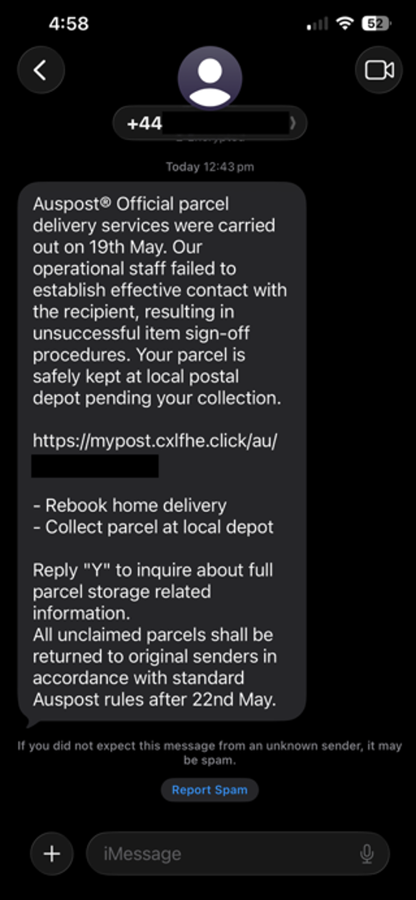
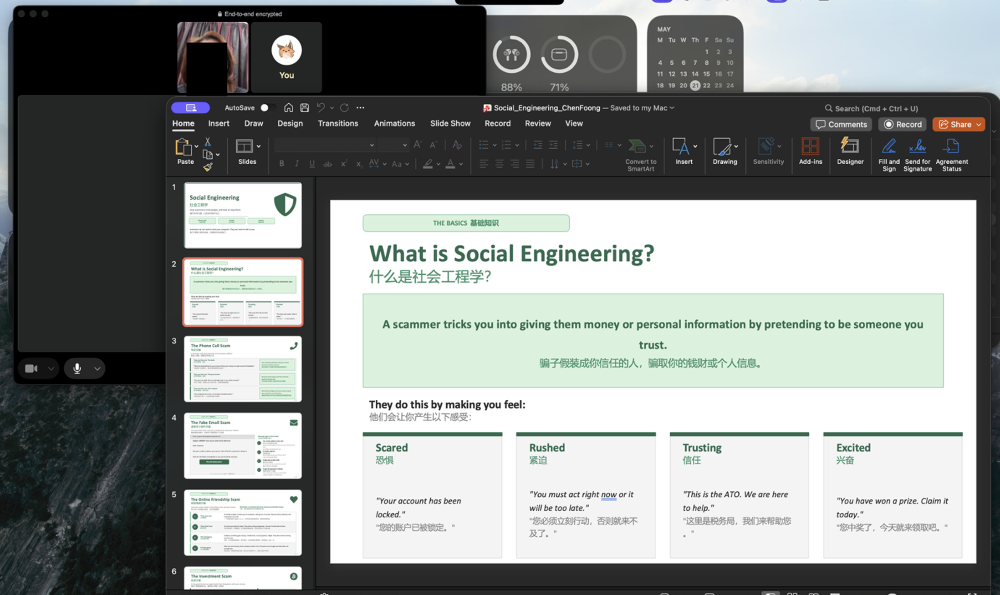

# B15. Teach an elderly person about cybersecurity topic of your choice.
Overview: I thought my (elderly) aunt about social engineering scams and how to correctly identify them. I specifically chose this topic as older people are often targeted through phone calls, text messages, emails and also online friendships, and these scams rely more on manipulation rather than technical hacking.
As my aunt is also a Chinese speaker, I created a bilingual slideshow in English and Mandarin so the explanations would be easier for her to understand. The slides covered the different common types of social engineering scams.
- Social Engineering: I explained that social engineering is when a scammer tries to trick someone into giving them money or personal data by pretending to be trustworthy. I highlighted the types of emotions scammers try to exploit, that being fear, urgency, trust and excitement, and gave examples like account being locked, tax debts, and also prizes that must be claimed immediately.
- I showed her examples of fake bank calls, fake parcel messages, fake emails, and online friendship scams. One practical screenshot I used was a fake AusPost parcel `SMS`. The message claimed a parcel could not be delivered. I told her about the warning signs that makes this message likely a scam, which is the phone country code, the suspicious link and urgent wording.

- The main rule I taught was that if someone contacts her asking for money, passwords, or personal details, she should stop, remain calm, and verify. I told her not to click links from unexpected messages, not to send money under pressure, and not to let anyone remotely access her laptop even if it is to “fix” it. I also told her that if she is unsure, to always contact me, another family member, or directly calling the phone number of the organisation herself using the phone number from the official site.

