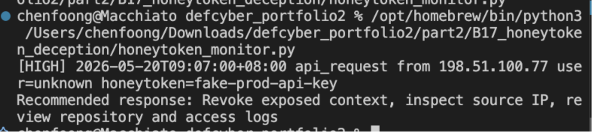
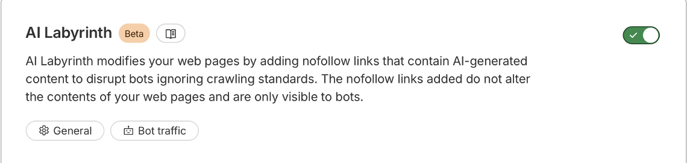

# B17. Implement one of the current state-of-the-art solutions and evaluate it.
Overview: Based on my B16 survey, I implemented a small honeytoken detection module as an example of deception technology. A honeytoken is a fake but realistic-looking data that should never be used normally, this would mean if it appeared in the logs, it can be treated as a strong signal that someone is trying to access or use something that they should not have.
Implementation
- I created two fake honeytokens: a fake production API key and also a fake admin password. I then created a python script that scans a set of sample log events and checks whether any honey token appears.
- The script first loads the honeytokens from `honeytokens.json`, and then reads sample events from `events.jsonl`. If a honeytoken value appears in an event message, the script will print a high severity alert with the timestamp, the event type, source IP, user, honeytoken label, and also a recommended response
- There are 4 sample events in events. Three simulates normal activity, and did not trigger any alert, however, one used the fake API key, which the python script correctly catches and triggers a high severity alert.

Limitations
- This is only a small local demonstration, a real organisation would need to put the honeytokens carefully and monitor them through logs, `SIEM` alerts or third-party cloud security tools.
Extra Evidence (Real Implementation on Personal Site)
- I also applied the same deception idea on my own website by using `Cloudflare AI labyrinth`. This Beta feature by `Cloudflare` is a real-world deception implementation that sends suspicious AI crawlers into decoy generated pages, instead of the real (my website) content.

