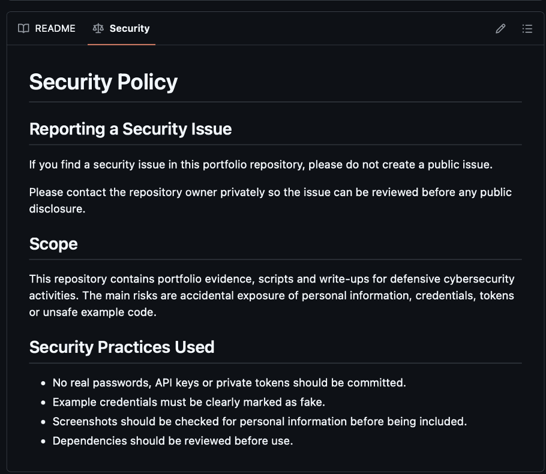
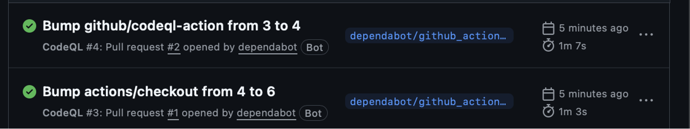
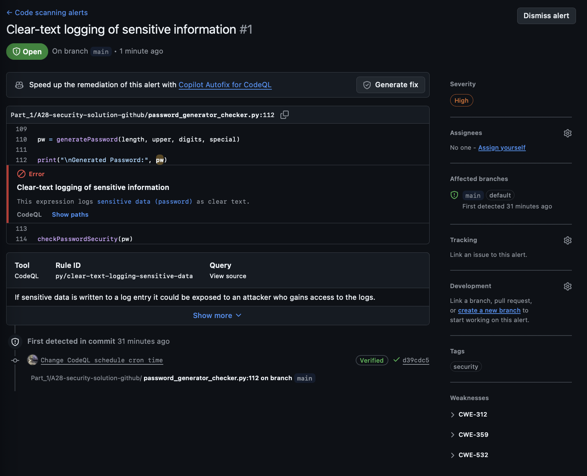

# B20. Enhance the security of a GitHub project.
Overview: I enhanced the security of this projects own `GitHub` repository by adding a security policy, `Dependabot` configuration and `CodeQL` scanning. This implementation can also be applied to other repositories as well especially public ones as it allows security issues to be reported responsibly and allows the code to be scanned for common security problems.
- Security Policy
I added a `SECURITY.md` file to the repository. This md file explains how security issues should be reported and can serve as a reminder to not include real passwords, API keys, private tokens or any personal information in the repository. This is relevant as the portfolio spans the entire semester, and portfolio contains screenshots, scripts, and other evidence files, so an accidental information exposure can be a realistic risk.

- `Dependabot`
I added a `.github/dependabot.yml` file. This allows `GitHub` `Dependabot` to check `GitHub` Action dependencies and suggest updates automatically. It also created an automated `GitHub Actions` update, showing that the configuration was active.

- `CodeQL`
I also added a `.github/workflows/codeql.yml` workflow. `CodeQL` is `GitHub`’s static analysis tool that scans the code for any common security issues and also coding mistakes. I configured it to run on pushes, pull requests and also on a weekly schedule. The `CodeQL` workflow ran successfully in `GitHub Actions`

`CodeQL` also successfully detected a high severity clear-text logging issue in my old password generator script. Although the password in this example was not real, the alert showed that `CodeQL` was working correctly as printing and logging passwords in plain text is considered a bad security practice.
Together, these three changes improve the security of my `GitHub` project by creating a vulnerability reporting process, automatically checking dependencies, and also scanning the repository for common security issues. This enhancement is not limited to just this repository and can and should be implemented on larger scaled repos.
