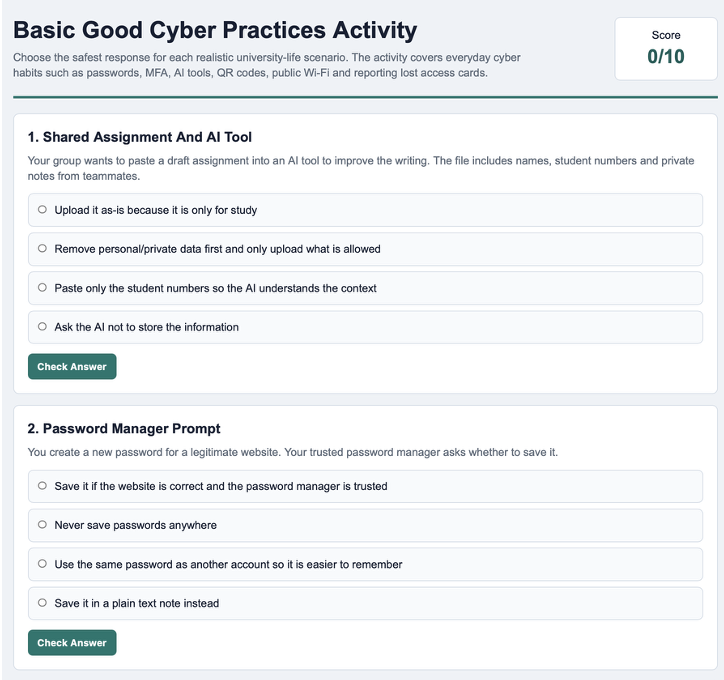
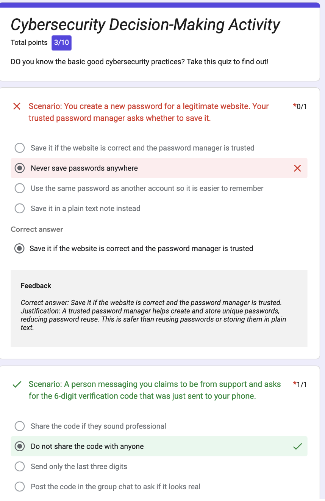

# B21. Design and implement a cybersecurity learning activity.
Overview: I made an Activity called “Basic Good Cyber Practices Activity”. This learning activity is designed to teach basic good cyber practices through realistic case scenarios that applies to university students. Instead of only listing rules, the activity asks learners to choose the safest action in common situations that they might face online or on the campus.
The activity covers:
- AI tool and assignment privacy
- Password manager use
- Unexpected `MFA` prompts
- `QR` code and payment risks
- Unknown USB device safety
- Public Wi-Fi and sensitive activity
- Group project file sharing permissions
- Verification code safety
- Lost student card reporting
This activity is in the form of a quiz. The learner will be able to choose the best response from four options. The aim for this is to ensure that every university student has the basic cybersecurity knowledge and to teach them if they don’t.
I first wrote the questions and answers and used AI tools to convert the questions into an interactive HTML website. The website will allow students to answer each question, receive feedback, and to see justifications to the answer. The HTML file is named activity.html.
As I also wanted students to be able to do the quiz without the html file (as I did not host it), I also transferred the questions to a Google Form, which students can directly interact with now through the link:   https://forms.gle/M26jN5ebHeQbScjY9.

