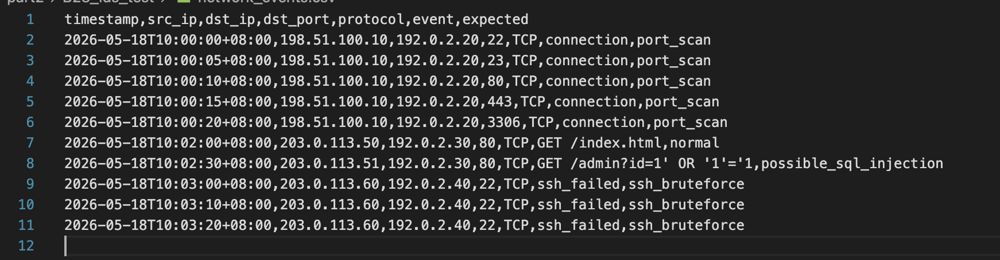
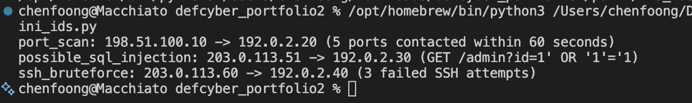
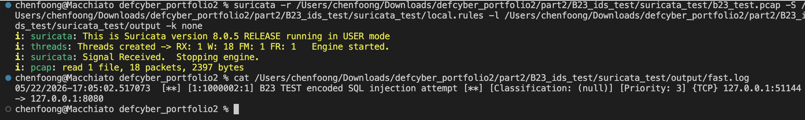

# B23. Test an intrusion detection system and discuss its effectiveness.
Overview: I tested a small local intrusion detection system in a controlled environment using sample network events. I used a simple Python `IDS`-style detector to show how IDK rules can identify suspicious behaviour.
- For the test, we used `network_events.csv` as the example network log. The actual detector is implemented in another file called `mini_ids.py`. The events are labelled as normal, port scan, possible SQL injection or SSH brute force so I could compare the `IDS` output against the `expected` result.


Note: “`expected`” is not used in the python file. I’ve just included that so that we can understand what each log should represent.
- There are a number of detection rules:
  - a. Port scan: one source IP containing fice or more ports on the same destinations within the span of 60 seconds
  - b. SQL injection: Web request that contains patterns such as ‘ OR ‘1’=’1 .
  - c. SSH brute force: three or more failed SSH login attempts that come from the same source going to the same destination
- Results: The `IDS` correctly generated one port scan alert. One for possible SQL injection, and another for SSH brute force alert. The normal web request did not trigger any alerts.


The `IDS` was overall effective for the controlled test and correctly detected all 3 suspicious behaviour that we placed in the dataset. There were no false positives present either. This demonstrates that rule-based `IDS` detection can work well when the suspicious pattern is already known and clearly defined.
However, as this is based on pre-determined rules, this detector may miss attacks that do not match the rules set in the python file. It can also create false positives for normal traffic if it happens to match a suspicious pattern. To improve this file, more realistic log entries could be added, and detection thresholds can be finer tuned based on real attacks. The functions should also include a wider range of attack patterns.

Using what I learnt, I also tested `Suricata`, an open-source `IDS`, with a simple rule to detect an SQL injection. I used a local Python web server and sent a controlled test request to it using `curl`.

```sh
curl "http://127.0.0.1:8080/admin?id=1%27%20OR%20%271%27=%271"
```

I then captured the local traffic using `tcpdump` and saved it as `b23_test.pcap`. I then ran `Suricata` against the packet capture using the custom rule file (`local.rules`)


`Suricata` generated an alert as the traffic matches the encoded SQL injection rule. This shows that a real `IDS` can inspect packet captures and trigger alerts when traffic matches a known suspicious signature. This is much more realistic compared to the python detector as it is a proper `IDS` engine that can process packet captures and is able to use rule files.
However, its effectiveness still depends on the rules. If the attacker changes the payload, our current `IDS` will miss it. This overall shows the usefulness of an `IDS`, but also shows that a good `IDS` would need good rules, tuning and also human review.
