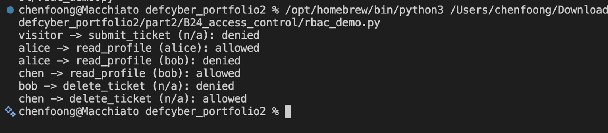

# B24. Design and implement access control of your choice.
Overview: I designed and implemented a small role-based access control system, which is based odd school and university helpdesk portal, where different users should have different levels of access to profiles and support tickets.
In a practical scenario:
- A guest should only be able to view public information
- A student should be able to view their own profile and submit a helpdesk ticket
- A student should not be able to view another student’s profile
- An admin should be able to view student profiles and also delete tickets
I created the roles for guest, student and admin. The program will check the user’s role before allowing an action to run. For profile access, the program also checks the owner of the resource. This means X user can read X’s own profile but cannot read Y’s.
The access control logic is written in `rbac_demo.py`. I used a dictionary called `ROLES` to define what each role can do. I also added `USERS` dictionary that assigns each user a role and also a profile ID. The actual function that makes the final access decision is `has_permission()`.
Testing:
I tested normal and blocked actions using assertions and printed results. As shown in the evidence, the system allowed Alice to read her own profile but denied her from reading Bob’s. The system allowed admin (chen) to read Bob’s profile. We also ensured the system denied Bob from deleting tickets but allowing the admin to.

This design also uses the principle of least privilege, as each role only receives the permissions needed for that role, nothing more.
