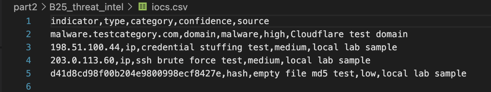
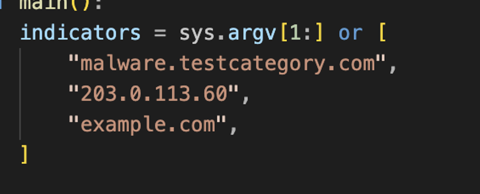
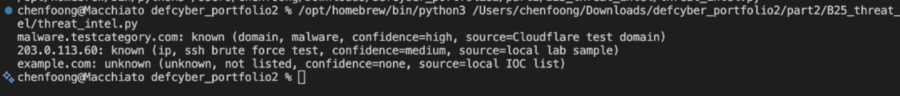

# B25. Design and implement a threat intelligence module of your choice.
Overview: I designed and implemented a simple threat intelligence lookup module. In lectures, threat intelligence is explained as more than just raw data. Raw indicators like IP addresses, domains and also file hashes become more useful when they are given context, source, confidence and a possible security meaning. In this activity, I focused on indicators of compromise (`IOCs`), which are pieces of data that could suggest suspicious or malicious activity.
The module checks an indicator to a local `IOC` list. The indicator can be a domain, IP address or a hash. If the indicator is in the list, then the module returns its type, category, confidence level and also the source. If the indicator is not in the list, the module will return it as unknown.
I used `iocs.csv` to store the threat intelligence list. `Threat_intel.py` contains the actual lookup logic and `results.txt` stores the output from testing the module. Each `IOC` contains an indicator, type, category, confidence, and source. The indicator is the actual value that is being checked, such as an IP address or a domain. The type shows whether it is a domain, IP address or hash. The category explains what kind of threat it is related to. The confidence should how confident the source is and the source shows where the information came from.

I tested the module using three indicators. Malware.testcategory was detected as a known malware-related domain, 203.0.113.60 is detected as a known SSH brute force test source, and example.com is not in the `IOC` list, and should return as unknown.

Output:

This type of module can be used to enrich logs or `IDS` alerts. One example is the IP address in a login log being more useful if it is matched to a known brute force source. This helps analysts to decide which event should be investigated first. It also shows why confidence and source matter a snot all threat intelligence has the same reliability.

Limitations: This is only a small demonstration, and it only detects indicators that already exist in the `IOC` list. An unknown result does not mean it is always safe, it just means it is not listed currently. The list could also be outdated over time, so a real threat intelligence would need regular updates and reviews. An improvement to this implementation would be to connect it to a larger feed, adding timestamps, include severity scoring and also allow it to check the logs automatically.
