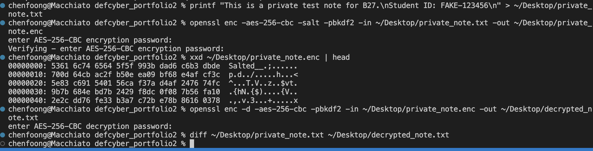
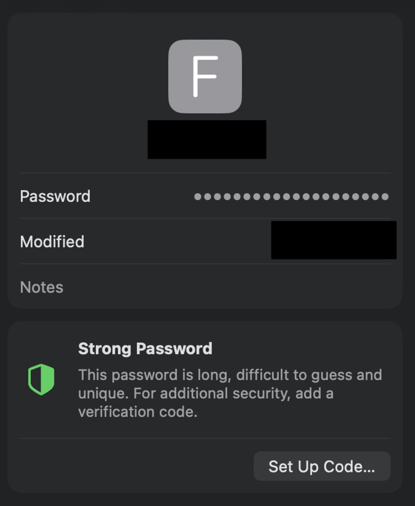

# B27. Apply a learned concept in this unit to a real-world application/problem/environment.
Overview: I applied the cryptography concept of symmetric encryption to solve the problem of needing to send sensitive files/photos through potentially unsafe network or apps. Whenever I need to do that, I encrypt it locally first before sending the encrypted `.enc` file instead of the plain file. I demonstrated the process of encrypting and decoding here on a text file.

The concept I used was symmetric encryption, which uses the same password/ secret key for encryption and decryption. Here, I used `OpenSSL` with `AES-256-CBC` and `PBKDF2`.  AES-256 is the encryption algorithm used, while `PBKDF2` is used to help get an encryption key from the password more safely as compared to using the password directly.

Once the file is encrypted, I send the `.enc` file over the (unsafe) network / app. This means even if someone intercepts my encrypted file, they would not be able to view it without knowing the password.
The demonstration shows the steps I take to encrypt and decrypt the file. `Private_note.txt` represents my sensitive files. I encrypt the file by running the command below (the note is stored on Desktop):

```sh
openssl enc -aes-256-cbc -salt -pbkdf2 -in ~/Desktop/private_note.txt -out ~/Desktop/private_note.enc
```

I then verify that it is not readable as normal text before sending the file:

```sh
xxd ~/Desktop/private_note.enc | head
```

Once I receive the file from my other device, I can then decrypt it:

```sh
openssl enc -d -aes-256-cbc -pbkdf2 -in ~/Desktop/private_note.enc -out ~/Desktop/decrypted_note.txt
```

Result:


- We can see that the encrypted file is not readable as normal text.
- We used diff to compare the decrypted file and the original file, and we confirmed that there are identical.

This is useful for protecting sensitive files before sending them through messaging apps, file transfer services (which I often use to transfer files between android and mac), or public networks as it adds an additional layer of security. This is also especially useful as it works on different file types. This reduces the risk of exposure if the transfer app, cloud, or network is exposed and accessed by someone else. The only limitation would be the algorithm used, and that the password should be strong. If the password is leaked, the file can be decrypted. Therefore, to manage this properly, I store the encryption password in `Apple Keychain`.

