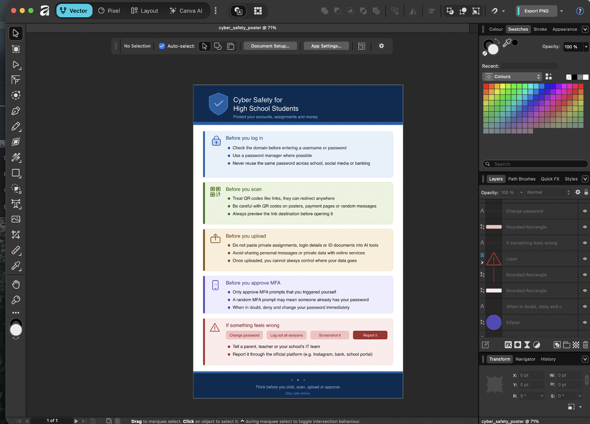

# B28. Produce a cyber safety flyer for (choose 1): elders, high school students, CEOs, Uni students.
Overview: I created a cyber safety flyer using AI and Affinity directed towards high school students. I chose the high school demographic as they often use school accounts, social media, online games, AI tools, and payment apps, but may not really recognise phishing or cyber attack attempts.

The flyer is titled Cyber Safety for High School Students. It was designed to be practical rather than being too technical, so each section focuses on a common situation that a high school student may face online. I chose a simple design with slightly dull colours and only included icons as I wanted it to look more informative, important, and serious.

The first part reminds students to check and make sure the website address is right before logging in. This is especially important as there can be fake login pages that looks like their school login portal, or other platform (Microsoft, Google, other social media) portals, that could potentially steal their logging credentials. The second part covers `QR` codes as they are common in posters but can still be malicious as they are just links and can potentially redirect students to malicious sites. The third is on data uploads, this stresses the importance of not sharing private data to AI tools and other online services without thinking where the information may go, and the potential damage it could cause if leaked. The fourth explains `MFA` approval prompts, when to accept, and what to do if a prompt appears without them triggering it. Finally, we also inform them of the simple response steps to take should they feel something is wrong.

Overall, the flyer is intended to inform students about good practices so that they can remain safer when they are online.

