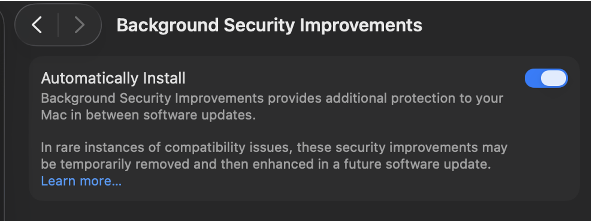
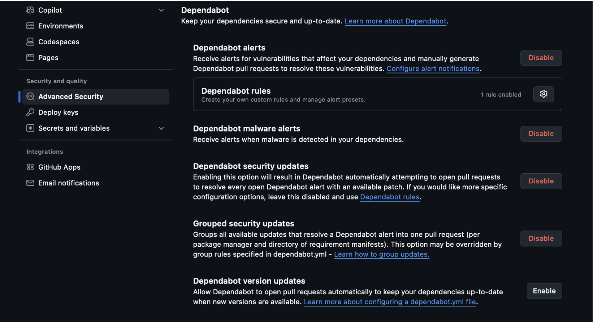
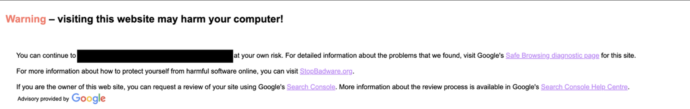
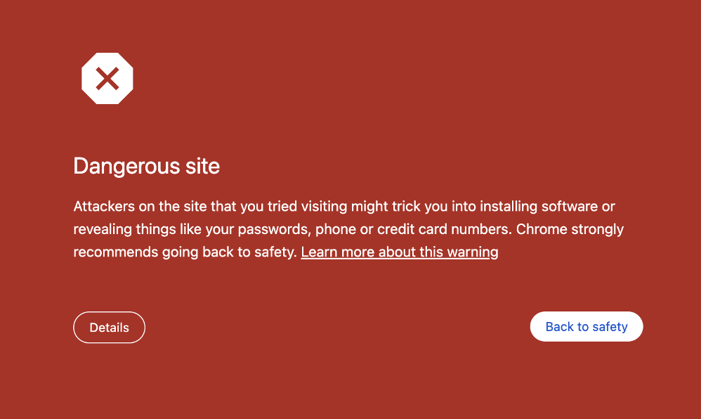
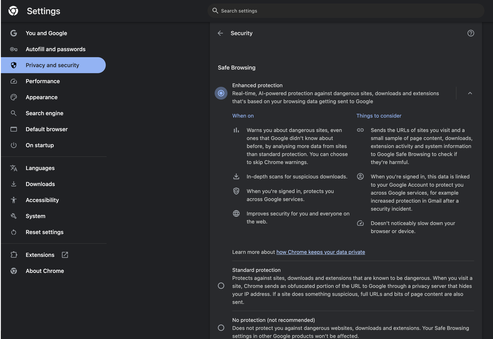

# B3. Discover 3 proactive security implementations in practice.
Overview: I identified three proactive security implementations that will help reduce risks before an attack succeeds. These are different from reactive controls as they act earlier, either by patching the issues, controlling access, or blocking suspicious activity before it even reaches the system.
## 1. Automatic Security Updates (Rapid security response)
Automatic security updates are considered proactive as they reduce the time where a device stays vulnerable from a potential attack after a fix is available. Apple uses a feature called “Rapid Security Responses” for some urgent security fixes, which allows important protections to be delivered without waiting for a full OS update. This is useful as attackers often try exploit known vulnerabilities as soon as they are found, so patching those vulnerabilities quickly would reduce the opportunity for exploitation.

## 2. `GitHub` `Dependabot` Alerts and security updates
`GitHub` `Dependabot` is proactive as it monitors the dependencies used in a project and will warn users if a dependency has a known vulnerability. The `Dependabot` security updates can also open pull requests to update vulnerable dependencies when a patched version is available. This is also considered proactive as it helps fix vulnerable packages before they can be exploited, rather than fixing it after the project is compromised and exploited.

## 3. Browser Safe Browsing / Fraudulent Website Warning
Browser safe browsing is proactive as it warns users before they visit a website that has been known to be a phishing, fraudulent or even malicious site. This stops a user before they can enter their password in the malicious site or download content from there. It does not replace the need to be educated about how to browse the internet safely, but it provides an early warning before a user interacts with a bad site.

