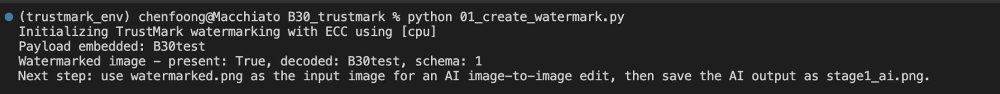
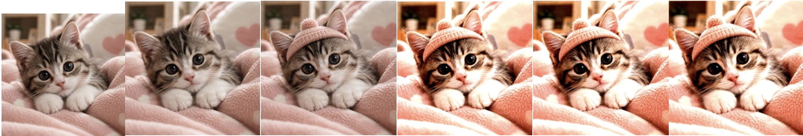
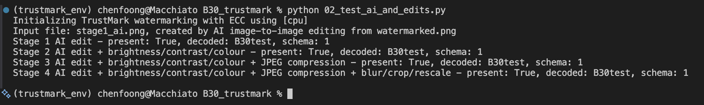

# B30. Generate an AI-created image, applying an imperceptible watermark on it and then perform an image-to-image regeneration or editing process to make sure the watermark is detectable---the watermark survives.
Overview: I generated an AI created image and tested whether an imperceptible watermark could survive an AI image-to-image edit and further editing. I used `TrustMark`, an invisible watermarking tool, that can be used to embed a hidden text payload into the image. The payload I used was “`B30test`”

To apply the watermark, I used the script `01_create_watermark.py`. The script loaded `original.png`, and embedded the hidden payload using `TrustMark`, and saved the result as `watermarked.png`. The watermark cannot be seen as it is not visible as text or logo on the image. The script then verified first if the watermark can be decoded from the image.

The result shows: Watermarked image - present: True, decoded: `B30test`, schema: 1, showing that the payload was retrievable.

Then, I put `watermarked.png` into and ChatGPT, which I prompted to add a hat to the cat. The output was then saved as `stage1_ai.png`. We then used `02_test_ai_and_edits.py` to iteratively check if payload can be retrieved and add more edits to the image. The overall process is listed below

(original ->  watermarked -> ai -> brightness + contrast -> compressed -> blur)

At each stage, the payload was able to be decoded, showing that the hidden watermark payload remained detectable through the edits. However, this does not mean that the watermark would survive every transformation. More aggressive edits and regenerations would most likely remove the watermark. Overall, this activity showed that it is possible for a watermark to survive a controlled image-to-image generating and editing process.
