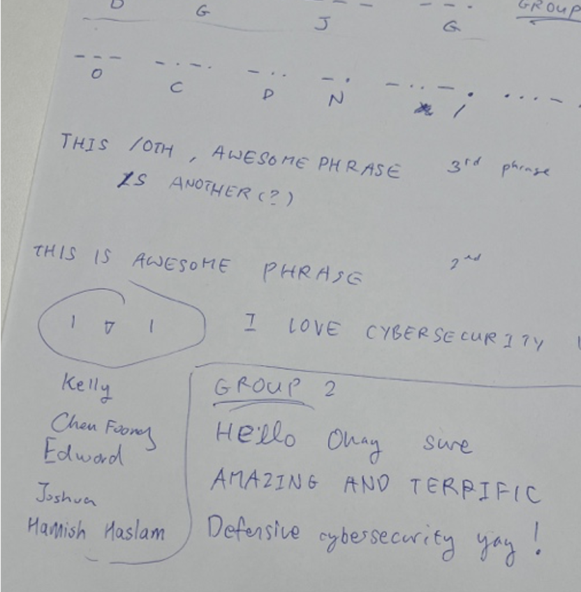
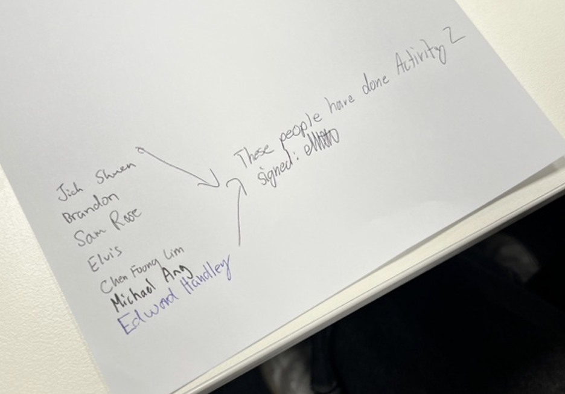
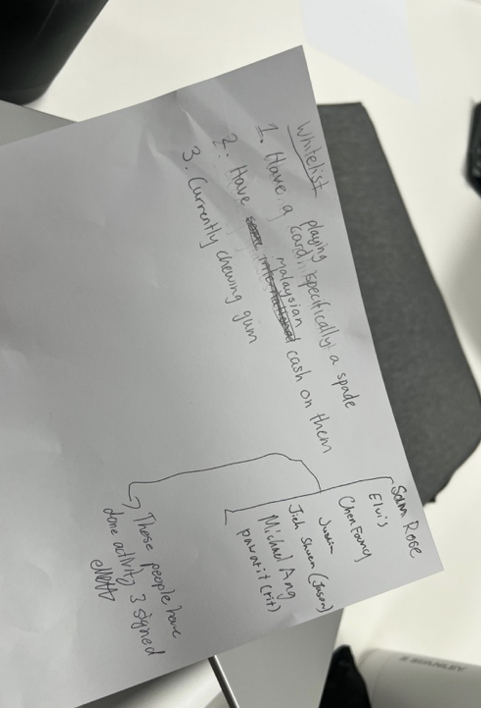
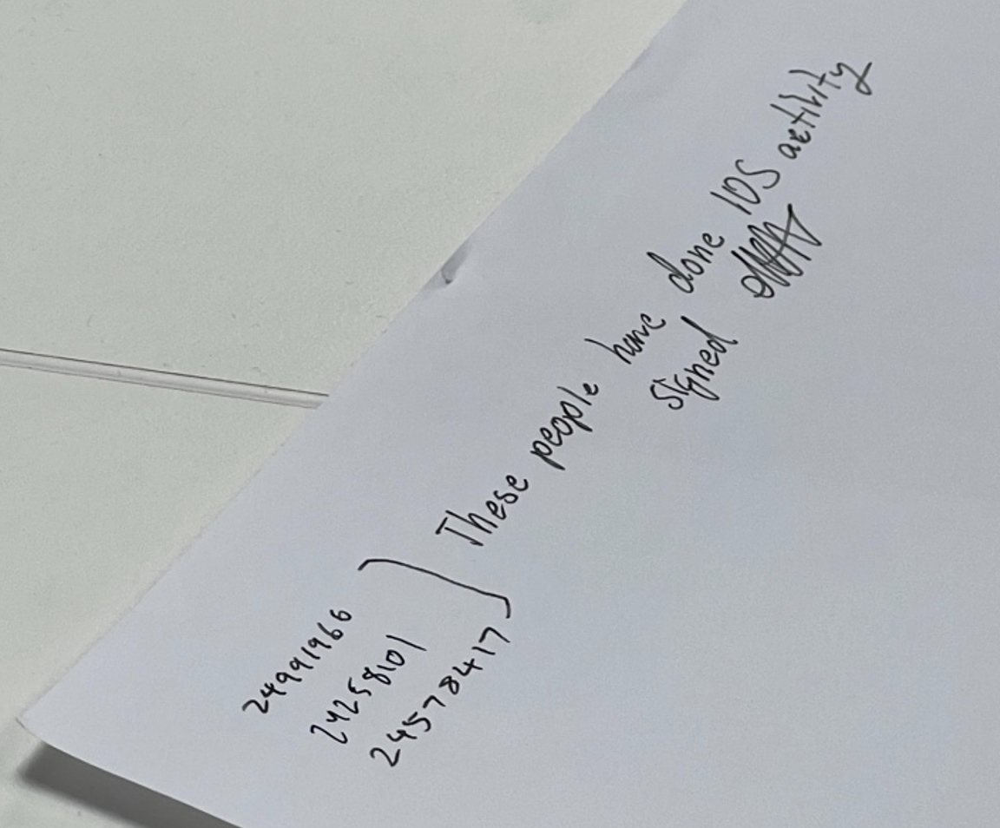

# B4. Participate in 3 in-class activities in labs (facilitators will administer such activities).
Overview: I participated in four in-class lab activities (included 4 as the first one had no signature). These activities covered encryption, privacy, access control and intrusion detection. Each of the activity we did was done in groups and demonstrates cybersecurity concepts in a practical way rather than only explaining it theoretically.
## 1. Encryption Activity
In the encryption activity, each group had to think of a couple of phrases and create a way to scramble the text. My group used a ROT-style substitution and wrote the text in reverse order. This meant the message was protected by two different transformations
After creating the encrypted phase, we then tried to crack other groups encrypted messages. One of the other groups used Morse code, and we used CyberChef to decode it.
This activity demonstrated encryption, and that it is only useful if the method is strong enough. Simple ciphers like what we did in this activity can hide message from people casually reading it but can be easily broken if the attacker recognises the pattern.

## 2. Privacy Activity
In the privacy activity, each person had to think of a random number representing their pay, and the goal was to calculate the total combined pay without revealing each person’s actual number.
We solved this by splitting our number into random chunks and giving those numbers to different people, while also keeping one random chunk to ourselves. Everyone did the same too, and at the end, each person adds up the chunks they received and shared only the subtotal. When all the subtotals are added together, the final result equalled to the original total sum of everyone’s pay, but no individual pay amount was directly revealed.
This activity demonstrated a privacy preserving technique, as the group was able to compute a useful result without exposing the raw (private) values.

## 3. Access Control Activity
In the access control activity, each group had to design an access control method using a combination of different authentication factors, such as something you have, something you know and something you are. My group chose a combination of different factors:
- Holding a Spade card
- Having Malaysian cash on hand
- Chewing gum
The idea was that using multiple authentication methods so that other groups would not be able to replicate and satisfy all 3 conditions at the same time. Even if they had one item, they would still need other items to gain “access”. This activity demonstrated access control, and the benefits of having a multi-factor authentication

## 4. `IDS` activity
In the `IDS` activity, we used playing cards to represent data traffic. We were given rules about which card represents “bad” and which that were considered “normal”. One person threw cards on the table quickly, and other members will have to remove as many bad cards as they can based on the specified rules. This simulates how an Intrusion Detection System works. The system tries to identify bad events from a large number of normal events, but as demonstrated, it can still make mistakes.
From this activity, we learnt about the concepts of true positives, false positives, true negatives, and false negatives. A true positive means the `IDS` correctly identified a bad card, a false positive means a normal card was incorrectly treated as a bad card, a false negative means a bad card was missed and a true negative means a normal card is correctly ignored by the `IDS`.

