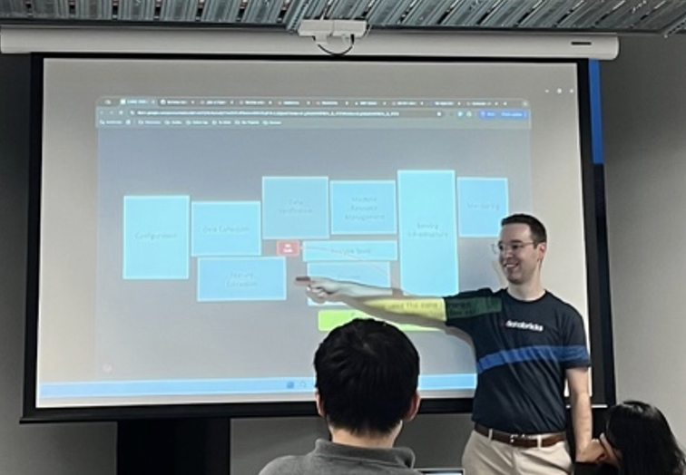
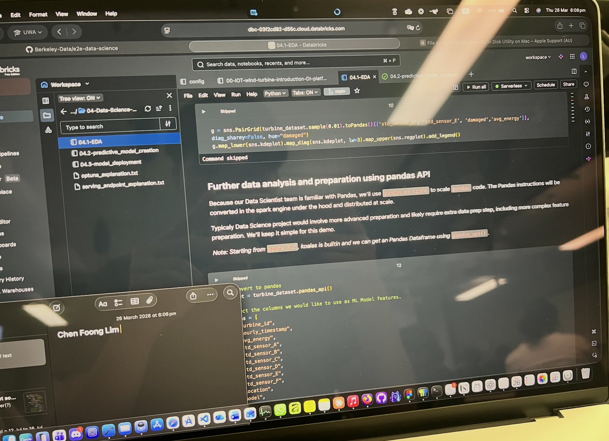
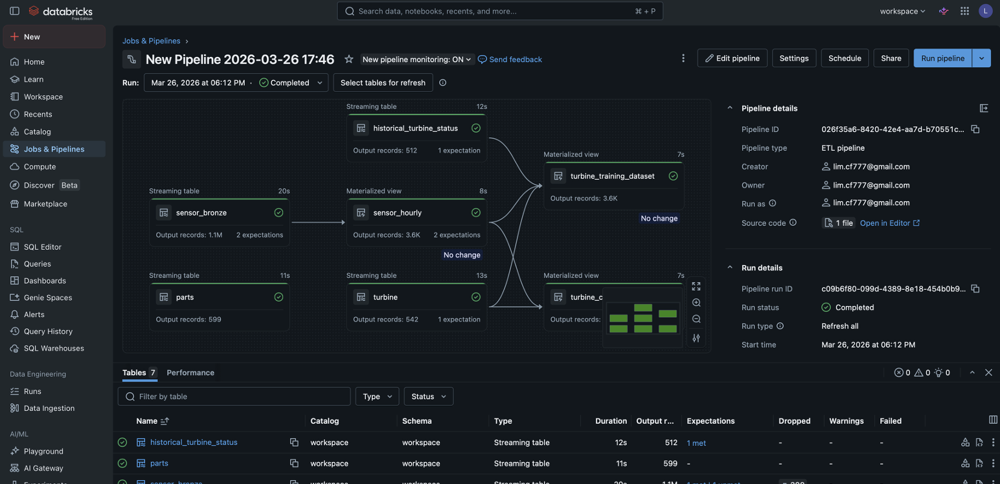

# B7. Participate in CS/DS/cybersecurity clubs’ activity.
Overview: I participated in a UWA Data Science Club activity titled “Machine Learning on Databricks” on 26 March 2026. This was a practical workshop where we used the Databricks Free Edition to go through an applied machine learning workflow.
The session introduced Databricks as a cloud platform that is used for data science and machine learning. The workflow covers data ingestion, exploratory data analysis (EDA), model creation and deployment. The presenter explained how a ML pipeline is more than just training a model, rather it requires first checking the data is clean, tracking the experiments, and eventually only deploying the model.

I followed along with the Databricks notebook through the workshop, one of which was for EDA, where the goal was to understand the dataset before we build the model. The dataset is based on wind turbine sensor readings.

I also had a Databricks pipeline run completed, which created tables like sensor_bronze, sensor_hourly, historical_turbine_status and turbine_training_dataset. This was the ETL stage that prepares the raw data into tables that we could use later for analysis and model training.

