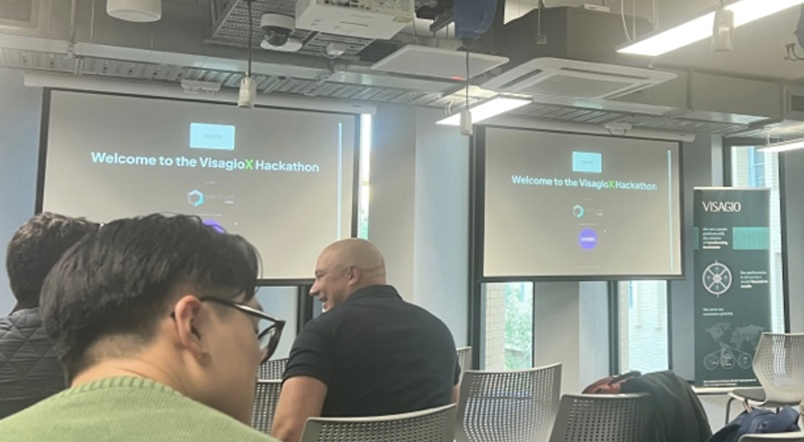
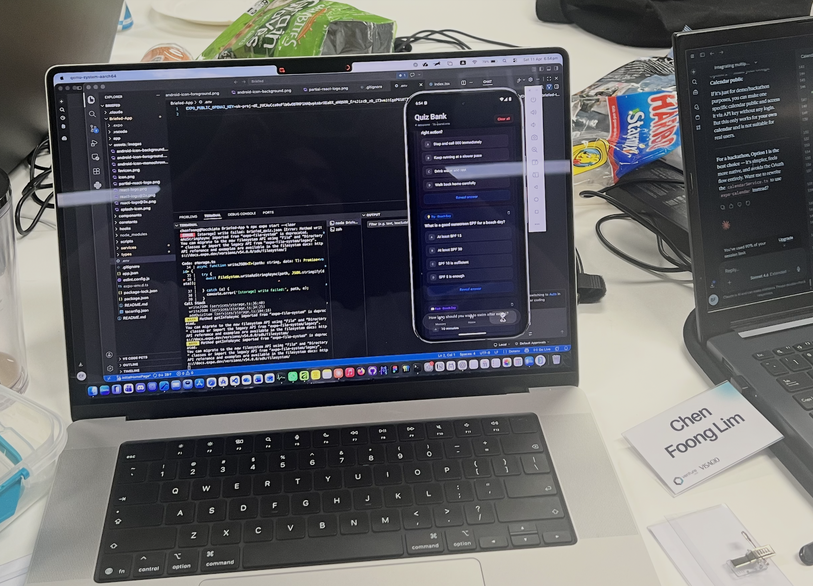
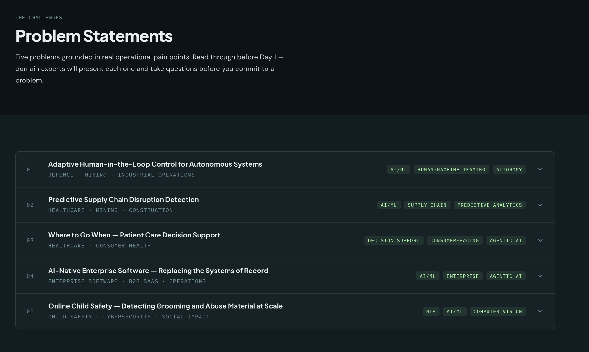
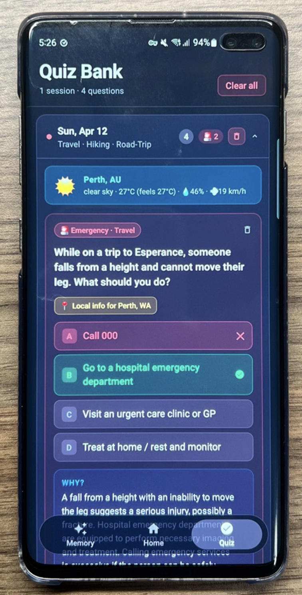

# B8. Participate in a hackathon.
Overview: I participated in a 3-day hackathon organised by VisagioX, from 10 April to 12 April. The hackathon gave 5 different problem statements, and my team chose the one titled “Where to Go When – Patient Care Decision Support”. The problem talks about reducing unnecessary emergency department visits by helping patients decide where to go before they call 000.

The problem statement explained that emergency department in hospitals are often filled with people who do not actually need emergency-level care, and sometimes going to the GP, urgent care clinic or pharmacy would be quicker and more appropriate. However, when a patient is stressed out or worried, they often default to going straight to the emergency department. Once they arrive, they system is required to treat them. The challenge was therefore to create something that would reach the patient before they make that decision.

We designed a mobile app that helps user learn where to go for different health situations. The app uses widgets and quizzes to repeatedly remind users whether a situation should be handled at home, at a pharmacy, by a GP, by an urgent care clinic, or by an emergency department.
The app also uses AI to generate likely risks based on what the user is planning to do. For example, if the user tells the app that they are going hiking, the AI may identify risks such as falling, dehydration, heat/UV exposure, or injury. Then, based on these risks, the AI generates quiz questions and widget reminders about what to do if that situation actually happens.
We also added tips and fun facts so that the app would not feel like something users would use only to learn about “where to go when”. For example, if the user tells the app that they are going hiking, the app also provides quizzes on hiking safety tips and related fun facts, making the app more engaging and increasing the chance that the user will keep using the app.
Below is the actual app that we built, showcasing the quiz feature:

Reflection: This hackathon helped me understand how technical solutions need to fit the moment where users make decisions. For this case, providing health information is not enough as people may not search for it during an emergency, a better approach would be to educate them earlier. The hackathon also taught the importance of privacy, how data should only be stored locally, and the whole app development process, from planning to deployment.
